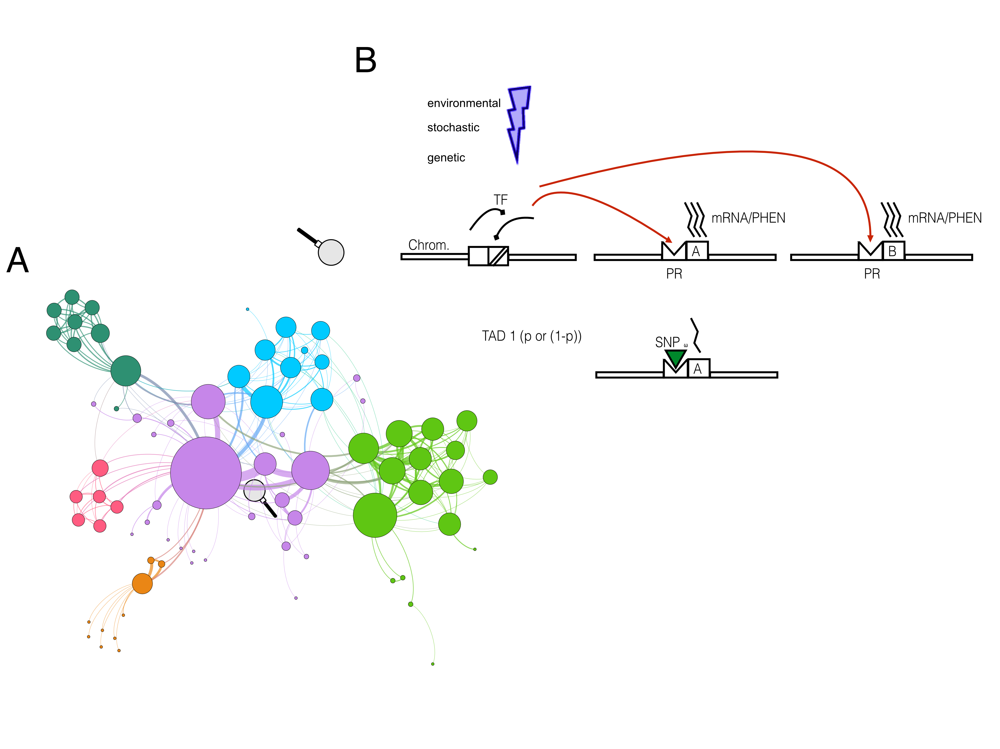
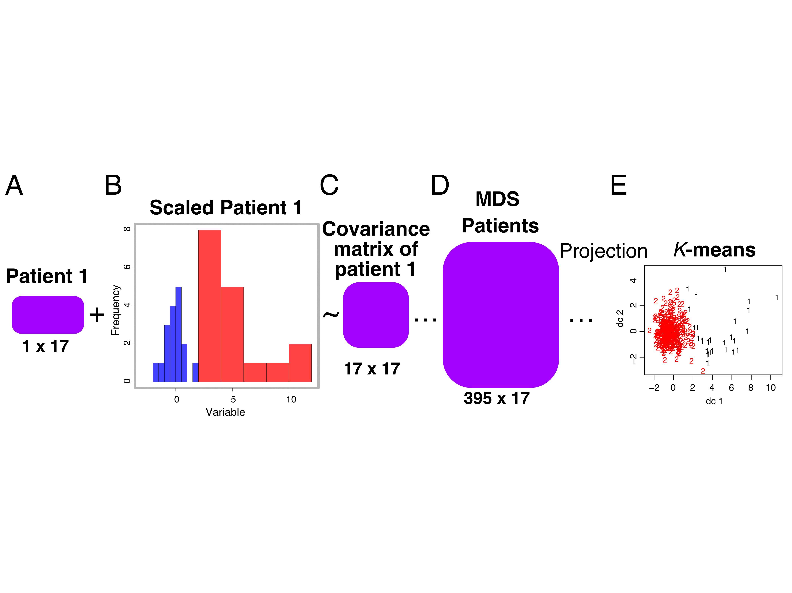
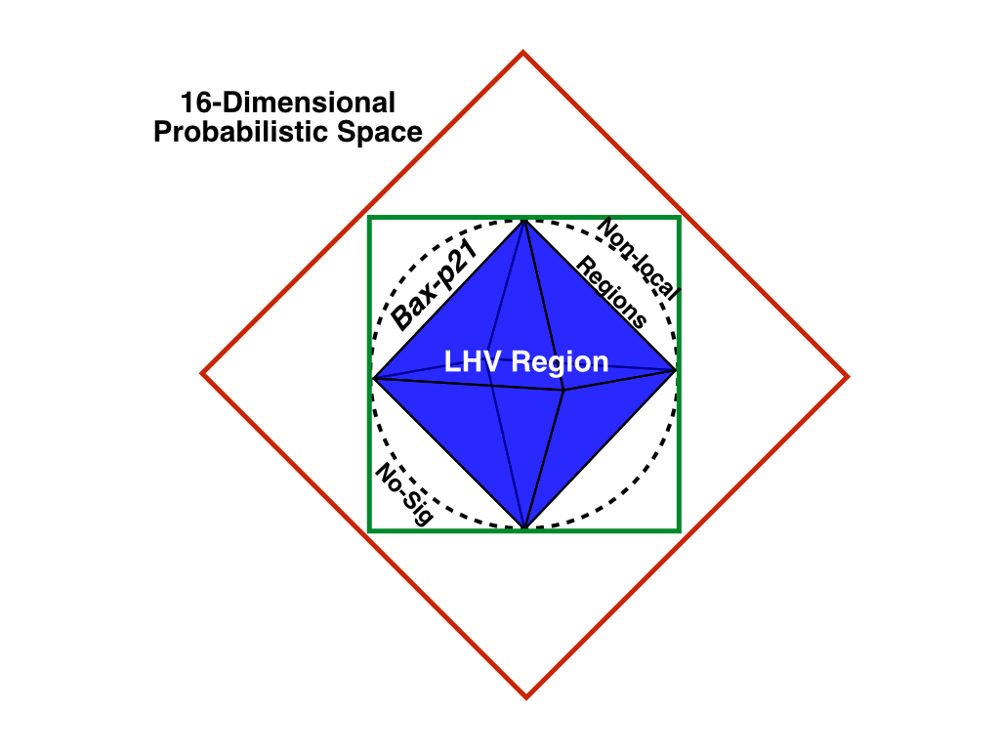

<div align="center">

# 🔔 Genetic-Bell

### A Non-Linear Model of Epistasis Inspired by Bell's Theorem

[](https://creativecommons.org/licenses/by-nc-nd/4.0/)
[](https://choosealicense.com/licenses/gpl-3.0/)
[](https://doi.org/10.3390/math11244916)
[](https://cran.r-project.org)
[%202023-orange)](https://www.mdpi.com/2227-7390/11/24/4916)

**Genetic-Bell** models gene–gene epistatic interactions using a non-linear framework drawn from the classic Bell experiment in quantum physics — placing SNP interaction patterns within a 42-dimensional probabilistic CHSH space to map disease-permissive states in complex genetic disorders.

[📄 Paper](#-citation) · [🚀 Quick Start](#-quick-start) · [🧬 The Model](#-the-model) · [📊 Key Results](#-key-results) · [🏗️ Framework](#️-framework)

</div>

---

## 🔍 Overview

In complex diseases, genes do not act independently — they form **bi-functional modules** within gene interaction networks, each module capable of existing in a *permissive* or *non-permissive* state with respect to disease susceptibility. When all modules in an individual simultaneously enter the permissive state, disease onset becomes possible.

**Genetic-Bell** formalises this with a striking analogy: just as Bell's theorem defines the boundary between *local hidden variable* (LHV) and *non-local* correlations in quantum mechanics, our model places gene–gene SNP interactions within a **CHSH inequality space**, revealing whether epistatic effects can be explained by classical additive genetics or require non-linear (non-local) interaction terms.

> **Key insight:** The proven global correlation of (*Bax*, *p21*) in functional modules places the model in the region **between the LHV polyhedron and the full interaction subspace** — neither purely additive nor maximally non-local — a uniquely interpretable position in the CHSH space that has no equivalent in standard epistasis models.

<p align="center">
  
  <br/>
  <em>Figure 1 — (A) Synthetic biological network of a complex disease, clustered by communities.<br/>
  (B) Correlation model of two nodes in the same community under environmental, stochastic, or genetic variation.</em>
</p>

---

## 🧬 The Model

### Bi-functional Modules and Disease Permissivity

A complex disease is characterised by a finite set of **bi-functional modules** — subgraphs of the gene interaction network whose nodes are (anti)correlated with a specific functional state (e.g., susceptibility to a non-Mendelian trait).

Within each module, **allelic variants** at risk loci act as genetic risk factors. A module enters a *permissive state* when these risk variants are expressed. Disease onset requires **all modules to simultaneously enter the permissive state**.

### The Bell Analogy

The Genetic-Bell framework maps this to the CHSH (Clauser-Horne-Shimony-Holt) inequality formalism:

| CHSH concept | Genetic-Bell interpretation |
|---|---|
| Local hidden variable (LHV) | Classical additive epistasis model |
| Non-local correlations | Non-linear gene–gene interactions |
| Bell inequality violation | Evidence of non-additive epistatic effects |
| CHSH space (42-dim) | Full probabilistic space of two-gene interactions |
| LHV polyhedron | Region explainable by independent allelic effects |

The position of a gene pair in this space directly tells you whether their interaction is **additive** (inside LHV), **non-linearly epistatic** (between LHV and interaction subspace), or **maximally correlated** (at the boundary).

### Promoter Variant Model

A variant ω in the promoter (PR) of gene A can impede the full phenotypical interaction with gene B, producing a disease-permissive state. This is modelled as a perturbation of the correlation tensor in the CHSH space — a precise, quantitative description of how a single regulatory variant alters module-level disease risk.

<p align="center">
  
  <br/>
  <em>Figure 2 — Genotype vs phenotype co-expression analysis pipeline:<br/>
  GWAS feature matrix → scaling → covariance → MDS → k-means clustering per GO function.</em>
</p>

---

## 📊 Key Results

<p align="center">
  
  <br/>
  <em>Figure 7 — 42-dimensional probabilistic CHSH space for the (Bax, p21) gene pair.<br/>
  Red: full interaction subspace. Blue: LHV polyhedron. Green: (Bax, p21) interaction subspace.<br/>
  The model places this pair <strong>between LHV and full interaction</strong> — neither additive nor maximally non-local.</em>
</p>

| Result | Detail |
|---|---|
| **CHSH positioning of (*Bax*, *p21*)** | Between LHV region and full interaction subspace |
| **Interpretation** | Non-additive epistasis, not explainable by independent allelic effects |
| **Model space** | 42-dimensional probabilistic CHSH space |
| **Application** | Complex disease (non-Mendelian) genetic risk stratification |
| **Implementation** | R (EM algorithm, k-means, MDS, covariance analysis) |

---

## 🏗️ Framework

```
Gene Interaction Network (graph)
          │
          ▼
  Community Detection
  → Bi-functional Modules
          │
          ▼
  Per-module GWAS Feature Matrix
          │
    ┌─────┴──────────────┐
    ▼                    ▼
 Standard           Covariance
 Scaling            Matrix
 (thresholds)           │
    │                   ▼
    └──────── MDS (Multidimensional Scaling)
                        │
                        ▼
              k-means Clustering
              (2 clusters per GO function)
                        │
                        ▼
          CHSH Space Projection
          (42-dimensional tensor)
                        │
              ┌─────────┴────────┐
              ▼                  ▼
         LHV region         Interaction
         (additive)         subspace
                        │
                        ▼
          Disease Permissivity Score
          per module and individual
```

The **EM_peaks/** folder contains the Expectation-Maximisation peak detection used to identify module-level transition points between permissive and non-permissive states.

---

## 🚀 Quick Start

### Requirements

- R ≥ 4.0
- See [`requirements` section](#-dependencies) for R packages

### Installation

```bash
git clone https://github.com/MorillaLab/Genetic-Bell.git
cd Genetic-Bell
```

### Run the model

```r
# In R
source("model/genetic_bell_model.R")

# Load your SNP interaction data
data <- load_gwas_matrix("your_data.csv")

# Compute CHSH space coordinates for a gene pair
chsh_coords <- compute_chsh(data, gene_a = "Bax", gene_b = "p21")

# Classify interaction (LHV / epistatic / non-local)
classify_epistasis(chsh_coords)
```

### Run EM peak detection

```r
source("EM_peaks/em_peak_detection.R")
peaks <- detect_peaks(module_data)
```

---

## 📦 Dependencies

```r
# Install all required packages
install.packages(c(
  "igraph",        # Gene interaction network / community detection
  "ggplot2",       # Visualisation
  "MASS",          # MDS and multivariate analysis
  "cluster",       # k-means clustering
  "mixtools",      # EM algorithm
  "corrplot",      # Covariance matrix visualisation
  "tidyverse",     # Data manipulation
  "rgl"            # 3D CHSH space visualisation (optional)
))
```

---

## 📁 Repository Structure

```
Genetic-Bell/
├── model/                      # Core R scripts: CHSH model, module analysis
├── EM_peaks/                   # EM algorithm for peak detection
├── .github/workflows/          # CI/CD
├── Figure1.png                 # Biological network + correlation model
├── Figure2.png                 # Genotype vs phenotype analysis pipeline
├── Figure7.png                 # CHSH space for (Bax, p21)
├── .gitignore
├── LICENSE                     # GPL-3.0
└── README.md
```

---

## 🎈 Citation

If you use Genetic-Bell in your research, please cite:

```bibtex
@article{kaba2023genetic,
  title   = {The Genotypic Imperative: Unraveling Disease-Permittivity in
             Functional Modules of Complex Diseases},
  author  = {Kaba, Mouhamad and Vomo-Donfack, Kelly L. and Morilla, Ian},
  journal = {Mathematics},
  volume  = {11},
  number  = {24},
  pages   = {4916},
  year    = {2023},
  doi     = {10.3390/math11244916},
  url     = {https://www.mdpi.com/2227-7390/11/24/4916},
  publisher = {MDPI}
}
```

---

## 🤝 Contributing

We welcome contributions — extensions to other gene pairs, new CHSH space projections, integration with eQTL or Hi-C data, or application to new disease contexts. Please open an issue before submitting a pull request. See [`CONTRIBUTING.md`](CONTRIBUTING.md) for guidelines.

---

## 📜 License

- **Code**: GNU General Public License v3.0 — see [`LICENSE`](LICENSE)
- **Paper / figures**: CC BY-NC-ND 4.0

---

<div align="center">
  Made with ❤️ by <a href="https://github.com/MorillaLab">MorillaLab</a>
  <br/>
  <sub>Kaba · Vomo-Donfack · Morilla · <em>Mathematics</em>, MDPI, 2023</sub>
</div>
